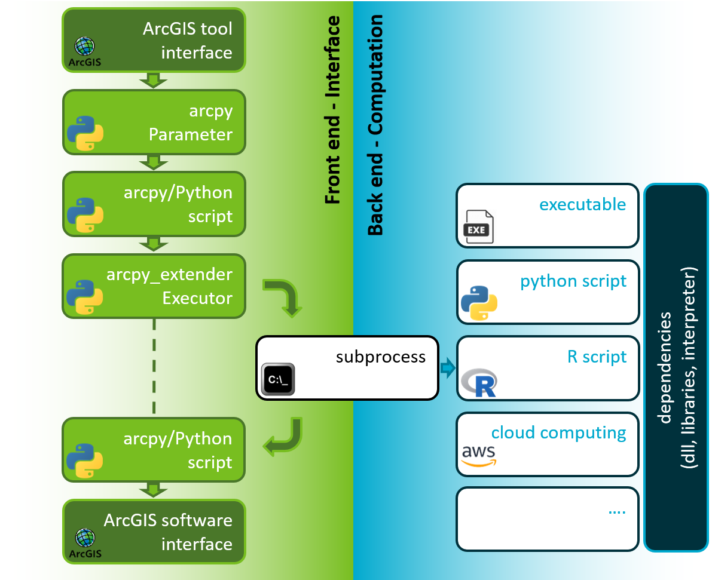

# xGIS (cross GIS)
This module was developed to break free from arcpy/ArcGIS delicate environment and leverage Python's full potential from within ArcGIS itself.

This was made possible by leveraging the `os` and `subprocess` libraries installed with any Python environment.
Those allow to directly interface with the operating system, and therefore to any executable (including Python).

So, what is the catch? we are not sharing memory between ArcGIS and the rest, meaning that we cannot pass variables and we have minimal communication.
Practically, your external python code must:
 - be completely self sufficient by loading and saving to disk
 - you cannot use arcpy from within it (but you can go back and forth between ArcGIS and the rest as many times as you like)
 - have a command line interface (typically achieved by using `argparse`, see `setup_external_libs.py`)

Here is a brief diagram explaining how this works:
<p align="center">
  
</p>


## Example usage
Here is a short example on how to print hello word using this tool.
This approach is equivalent to executing `python -c 'print("hello world!")'` in powershell
```python
>>> import xgis
>>> exe = xgis.Executor(['python.exe', '-c', 'print("hello world!")'])
>>> exe.run()
15:56:57        Running python.exe externally
15:56:57           Working directory 'C:\Temp\********'
15:56:57           Executable 'C:\Python27\ArcGISx6410.5\python.exe'
15:56:57           Arguments python.exe -c print("hello world!")
15:56:57           ***** SubProcess Started *****
15:56:58           hello world!
15:56:58           ***** SubProcess Completed *****
```

The Executor object allows you to control your environment using a simple interface. For example:
```python
# defining arguments
>>> args = ['sklearn_script.py', 'input.csv', '--outname', 'out.csv']
# defining the folder location where additional Python libraries are stored (those will have priority over others)
>>> external_libs = '../../project_folder/external_libs/'
# defining a specific executable to use
>>> py_exe = 'C:/Python27/ArcGISx6410.5/python.exe'
# initialise the Executor object
>>> exe = xgis.Executor(args, external_libs=external_libs, executable=py_exe)
# print the current settings 
>>> exe.info()
Current settings are:
  executable          : 'C:\Python27\ArcGISx6410.5\python.exe'  # Our specified python interpreter
  working directory   : 'C:\xxxx\xxxx_xxxx\xxxx'
  arguments           : 'C:\xxxx\xxxx_xxxx\xxxx\sklearn_script.py'  # Fully resolved script path
                      : 'input.csv'
                      : '--outname'
                      : 'out.csv'
  PATH                : 'C:\xxxx\project_folder\external_libs\lib\site-packages\osgeo'  # Detected gdal, it will add GDAL_PATH and GDAL_DRIVER_PATH as well
                      : 'C:\xxxx\project_folder\external_libs\lib\site-packages\osgeo\gdal-data'
                      : 'C:\xxxx\project_folder\external_libs\lib\site-packages\osgeo\gdalplugins'
                      : 'C:\xxxx\project_folder\external_libs'  # Fully resolved external_libs path
                      : 'C:\xxxx\project_folder\external_libs\lib'
                      : 'C:\xxxx\project_folder\external_libs\lib\site-packages'
                      : 'C:\ProgramData\DockerDesktop\version-bin'
                      : 'C:\Program Files\Docker\Docker\Resources\bin'
                      : 'C:\Windows\system32'
                      : 'C:\Windows'
  PYTHONPATH          : 'C:\xxxx\project_folder\external_libs'
                      : 'C:\xxxx\project_folder\external_libs\lib'
                      : 'C:\xxxx\project_folder\external_libs\lib\site-packages'
  GDAL_DRIVER_PATH    : 'C:\xxxx\project_folder\external_libs\lib\site-packages\osgeo\gdalplugins'
  GDAL_DATA           : 'C:\xxxx\project_folder\external_libs\lib\site-packages\osgeo\gdal-data'
# run
>>> result = exe.run()
Running 'C:\xxxx\xxxx_xxxx\xxxx\sklearn_script.py' externally
   Working directory 'C:\xxxx\xxxx_xxxx\xxxx'
   Executable 'C:\Python27\ArcGISx6410.5\python.exe'
   Arguments 'C:\Python27\ArcGISx6410.5\python.exe C:\xxxx\xxxx_xxxx\xxxx\sklearn_script.py input.csv --outname out.csv'
   loading data from input.csv
   preprocessing the data
   training the GAUSSIAN_MIXTURE model
   perform prediction
   RESULT: out.csv  # the stream handler will search for this pattern and return them
>>> print(result)
['out.csv']
```

## Advanced functionalities

The Executor object handles automatically most of the set up, but gives you control and visibility over most of it.
This object offers the following attributes and methods:
```python
Executor.executable     # Executable used to run the command line passed (e.g. python.exe)
Executor.cmd_line       # command line arguments (e.g. ['script.py', '--test_file', 'input.csv'])
Executor.cwd            # working directory to use
Executor.host           # for future support of QGIS and other
Executor._environ       # os.environ to use when running the subprocess call
Executor.logger         # logging Logger used by the Executor to report on the subprocess call


Executor.set_executable()
Executor.set_cmd_line()
Executor.set_cwd()
Executor.set_external_libs()
Executor.set_logger()
Executor.info()         # print current settings
Executor.run()          # run the subprocess call

ExternalExecutionError  # error raised when the execution fails. It exposes the errno exit code reported by the subprocess
```

Message passing functionalities are limited, but the Executor will automatically retrieve lines starting with `RESULT: ` and return their content (by invoking the run() method).
This allows you to communicate basic information like a file name or outcome of an operation.
This should not be used to pass large information.

The Executor will also monitor stdout, stderr and the exit code.
Stdout will be streamed back to the parent process (arcpy/ArcGIS) using the defined logger
Stderr will be only streamed back if the exit code is not 0 (abnormal termination).


## Setting up your environment in Python
This repository provides you a convenient script to help you installing python modules and wheels in the right way.
This is located in Scripts/setup_external_libs.py and has a handy command line interface.
This can be as easy as:
```bash
>>> python.exe ./Scripts/setup_external_libs.py --pkgs numpy matplotlib==3.1.1 pandas>=0.23.4 --whls geopandas-0.5.0-py2.py3-none-any.whl
```
It also supports the definition of a requirements file in the yaml format (to not interfere with python widely used requirements.txt)
This file can be defined as follow
```yaml
pkgs:
  - 'numpy'
  - 'matplotlib==3.1.1'
  - 'pandas>=0.23.4'
whls:
  - 'geopandas-0.5.0-py2.py3-none-any.whl'
```

and used as follow:
```bash
>>> python.exe ./Scripts/setup_external_libs.py --yaml requirements.yaml
```

You can also specify the folder location to locally store this separate environment (default to ./external_libs)
```bash
>>> python.exe ./Scripts/setup_external_libs.py --target ./myenv
```

## Compatibility with ArcGIS
This tool was developed for ArcGIS Desktop 10.5 and newer versions, but I'm planning to support ArcGIS Pro.
This will require transitioning to a Python 2 and Python 3 compatible code.

As this approach requires only common libraries like `os`, `subprocess` and `logging`, there is no additional complexity in supporting newer and different versions of ArcGIS.

This module is fully importable and usable from within ArcGIS/arcpy, but will allow you to leverage python resources that would otherwise break the delicate ArcGIS Python environment.

## License

This software is available under the following license:
```
CSIRO Open Source Software Licence Agreement (variation of the BSD / MIT License)
Copyright (c) 2019, Commonwealth Scientific and Industrial Research Organisation (CSIRO) ABN 41 687 119 230.
All rights reserved. CSIRO is willing to grant you a licence to this xGIS on the following terms, except where otherwise indicated for third party material.
Redistribution and use of this software in source and binary forms, with or without modification, are permitted provided that the following conditions are met:
* Redistributions of source code must retain the above copyright notice, this list of conditions and the following disclaimer.
* Redistributions in binary form must reproduce the above copyright notice, this list of conditions and the following disclaimer in the documentation and/or other materials provided with the distribution.
* Neither the name of CSIRO nor the names of its contributors may be used to endorse or promote products derived from this software without specific prior written permission of CSIRO.
EXCEPT AS EXPRESSLY STATED IN THIS AGREEMENT AND TO THE FULL EXTENT PERMITTED BY APPLICABLE LAW, THE SOFTWARE IS PROVIDED "AS-IS". CSIRO MAKES NO REPRESENTATIONS, WARRANTIES OR CONDITIONS OF ANY KIND, EXPRESS OR IMPLIED, INCLUDING BUT NOT LIMITED TO ANY REPRESENTATIONS, WARRANTIES OR CONDITIONS REGARDING THE CONTENTS OR ACCURACY OF THE SOFTWARE, OR OF TITLE, MERCHANTABILITY, FITNESS FOR A PARTICULAR PURPOSE, NON-INFRINGEMENT, THE ABSENCE OF LATENT OR OTHER DEFECTS, OR THE PRESENCE OR ABSENCE OF ERRORS, WHETHER OR NOT DISCOVERABLE.
TO THE FULL EXTENT PERMITTED BY APPLICABLE LAW, IN NO EVENT SHALL CSIRO BE LIABLE ON ANY LEGAL THEORY (INCLUDING, WITHOUT LIMITATION, IN AN ACTION FOR BREACH OF CONTRACT, NEGLIGENCE OR OTHERWISE) FOR ANY CLAIM, LOSS, DAMAGES OR OTHER LIABILITY HOWSOEVER INCURRED.  WITHOUT LIMITING THE SCOPE OF THE PREVIOUS SENTENCE THE EXCLUSION OF LIABILITY SHALL INCLUDE: LOSS OF PRODUCTION OR OPERATION TIME, LOSS, DAMAGE OR CORRUPTION OF DATA OR RECORDS; OR LOSS OF ANTICIPATED SAVINGS, OPPORTUNITY, REVENUE, PROFIT OR GOODWILL, OR OTHER ECONOMIC LOSS; OR ANY SPECIAL, INCIDENTAL, INDIRECT, CONSEQUENTIAL, PUNITIVE OR EXEMPLARY DAMAGES, ARISING OUT OF OR IN CONNECTION WITH THIS AGREEMENT, ACCESS OF THE SOFTWARE OR ANY OTHER DEALINGS WITH THE SOFTWARE, EVEN IF CSIRO HAS BEEN ADVISED OF THE POSSIBILITY OF SUCH CLAIM, LOSS, DAMAGES OR OTHER LIABILITY.
APPLICABLE LEGISLATION SUCH AS THE AUSTRALIAN CONSUMER LAW MAY APPLY REPRESENTATIONS, WARRANTIES, OR CONDITIONS, OR IMPOSES OBLIGATIONS OR LIABILITY ON CSIRO THAT CANNOT BE EXCLUDED, RESTRICTED OR MODIFIED TO THE FULL EXTENT SET OUT IN THE EXPRESS TERMS OF THIS CLAUSE ABOVE "CONSUMER GUARANTEES".  TO THE EXTENT THAT SUCH CONSUMER GUARANTEES CONTINUE TO APPLY, THEN TO THE FULL EXTENT PERMITTED BY THE APPLICABLE LEGISLATION, THE LIABILITY OF CSIRO UNDER THE RELEVANT CONSUMER GUARANTEE IS LIMITED (WHERE PERMITTED AT CSIRO'S OPTION) TO ONE OF FOLLOWING REMEDIES OR SUBSTANTIALLY EQUIVALENT REMEDIES:
(a)               THE REPLACEMENT OF THE SOFTWARE, THE SUPPLY OF EQUIVALENT SOFTWARE, OR SUPPLYING RELEVANT SERVICES AGAIN;
(b)               THE REPAIR OF THE SOFTWARE;
(c)               THE PAYMENT OF THE COST OF REPLACING THE SOFTWARE, OF ACQUIRING EQUIVALENT SOFTWARE, HAVING THE RELEVANT SERVICES SUPPLIED AGAIN, OR HAVING THE SOFTWARE REPAIRED.
IN THIS CLAUSE, CSIRO INCLUDES ANY THIRD PARTY AUTHOR OR OWNER OF ANY PART OF THE SOFTWARE OR MATERIAL DISTRIBUTED WITH IT.  CSIRO MAY ENFORCE ANY RIGHTS ON BEHALF OF THE RELEVANT THIRD PARTY.
```
